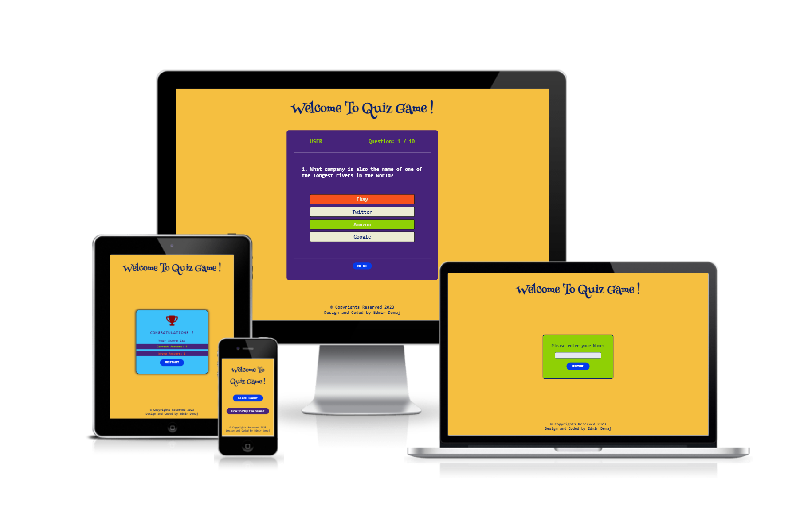
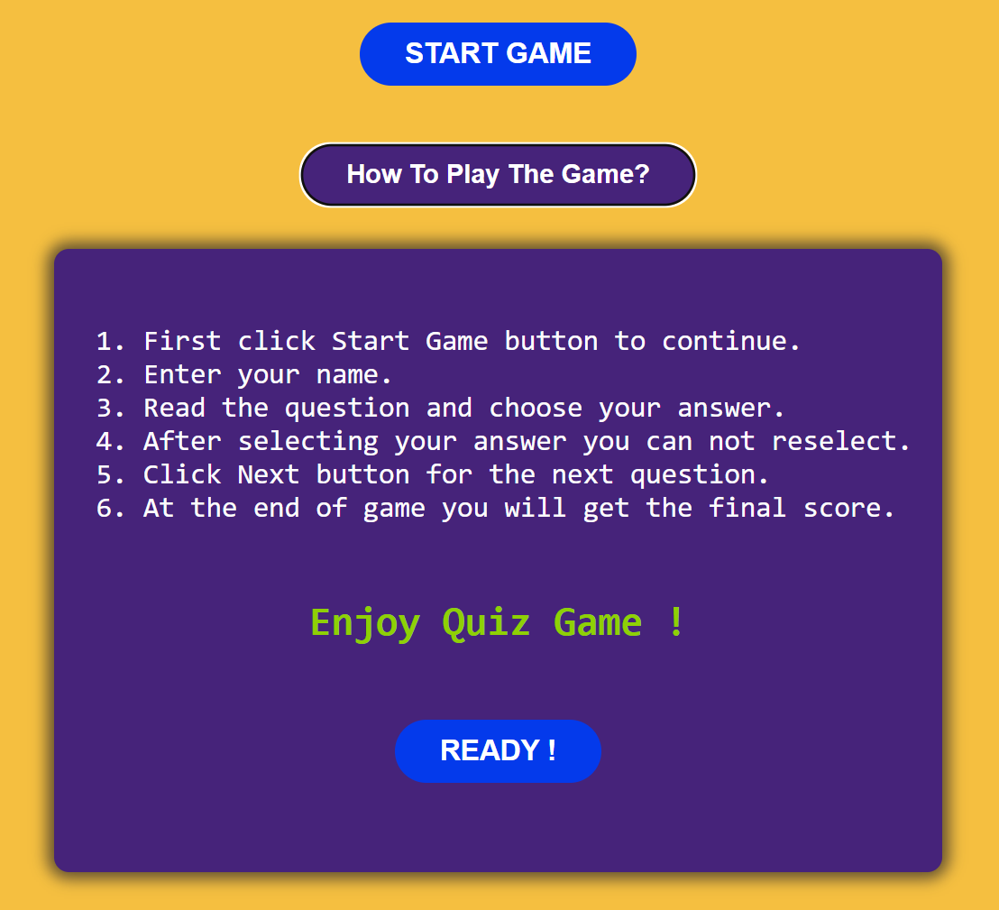
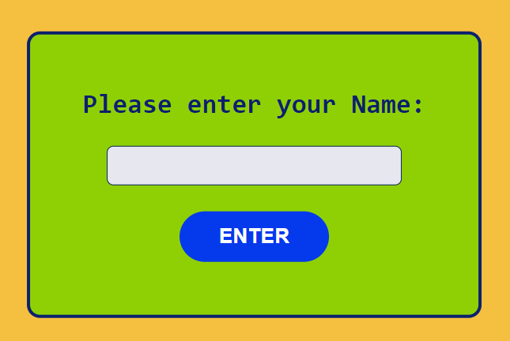
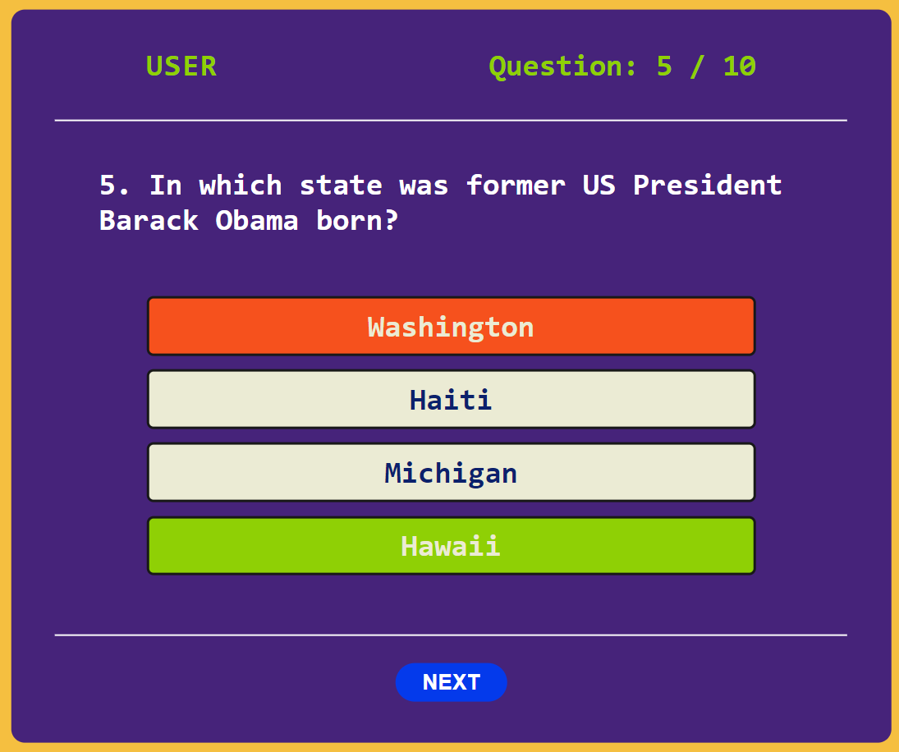
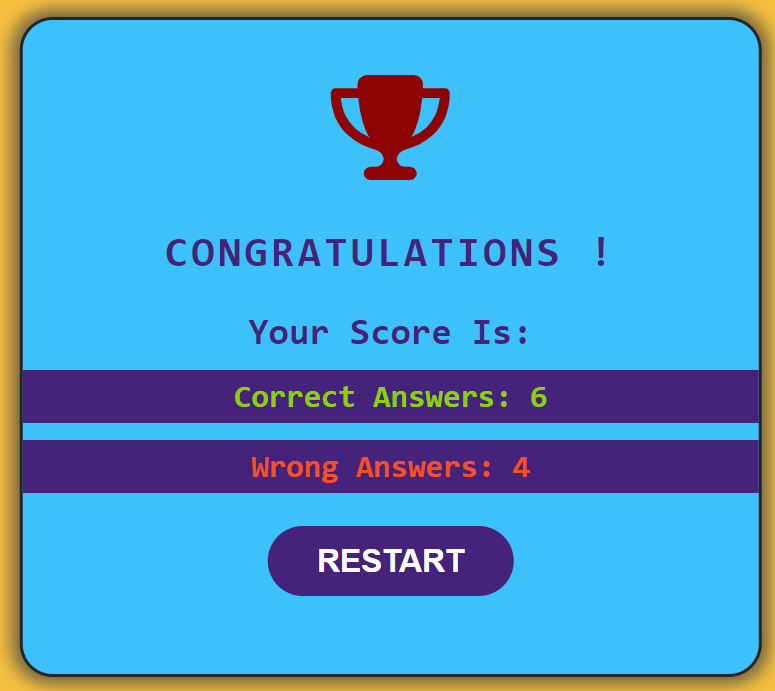
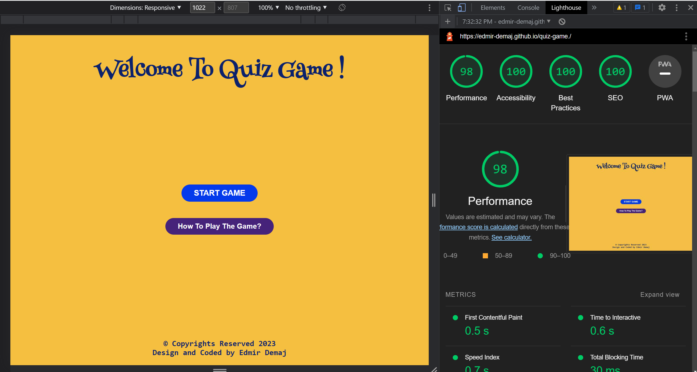
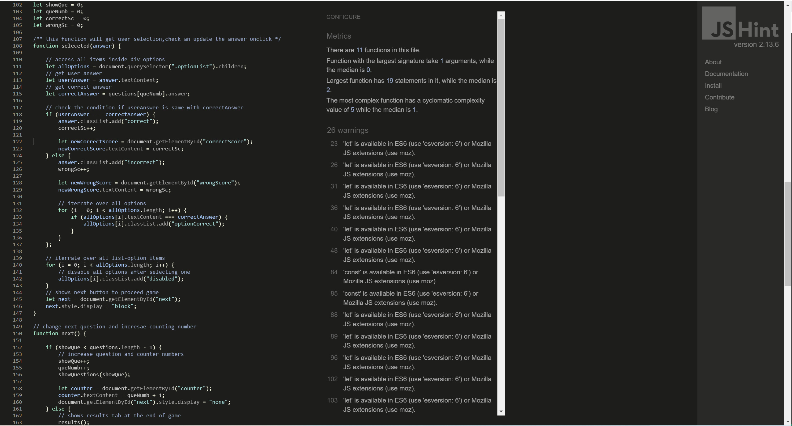
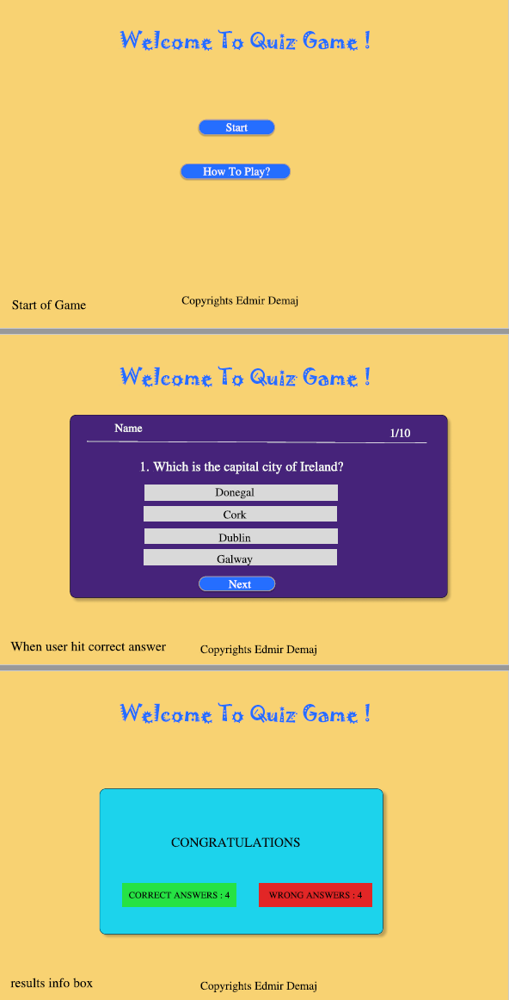

# **Quiz Game !**

[View live project here.](https://edmir-demaj.github.io/quiz-game./)

**Quiz Game** is a web application created for users to test their knowledges with a variety of questions and of course have funn while they play it. As a game target anyone who likes mind games, different age groups. This quiz-game contains a level of difficulty easy to medium with questions from different fields. A design with variety and strong colors so user can have a great experience playing the game and enjoying colors aswell.

Check out how it looks in different screen sizes:

# **Features**

## **1. Start Game & How to play the Game buttons.**
- -Start Game- button once is clicked opens the game.
- -How to play the Game- button once is clicked opens game rules box.
- Game rules box explain to user how to play the quiz game.

## **2. User Name details**
- After Start Game button clicked a userName form shows.
- This form ask user to provide name in order to continue further.
- Name provided will be showed on quiz box.

## **3. Questions box**
- This box contains userName, a questions counter, questions, options and next button.
- Once an option is selected correct answer will highlight with green color and the wrong answer with red color.
- After selection the other options won't be available to select.
- Next button will show to move to next question.

## **4. Results box**
- At the end of the game user will be provided the final score.
- User can see how many were correct and how many were incorrect.
- A message will be displayed based on the final score.
- Restart button will restart the game starting from score zero.

## **Features left to implement**
- In the future would like to add a timer for user to answer.
- Add an option to choose difficulty of game, based on this to show different questions.
- Increase number of questions.
- Add option to choose the category of questions for example sport, history, art etc.

# **Testing**

## **Validator Testing**

- The HTML code is tested on [W3C HTML Validator](https://validator.w3.org/nu/#textarea) and no errors were found.

- The CSS code is tested on [W3C Jigsaw Validator](https://jigsaw.w3.org/css-validator/validator) and no errors were found.

- The JAVASCRIPT code is tested on [Jshint Validator](https://jshint.com/) and no errors were found.

## **LIghthouse Testing**

The web app is tested on Lighthouse devtools on Google Chrome to check the performance and accesibility and the results are below:

## **Browsers Testing**

The web app is checked in different browsers to see if works properly and if is maintained the design and features wanted.

Browsers used and their versions:
- Google Chrome version 105.05
- Microsoft Edge version 105.0
- Firefox version 105.0
- Opera version 90.0

## **Unfixed bugs**

There are no unfixed bugs.

## **Fixed bugs**

- An error showed on W3C HTML Validator, an ID was used 2 times. To fix i removed from code one ID.
- An error showed on W3C CSS Validator, unit wasn't set properly. Set proper unit (rem).
- Jshint was showing  "let is available in es6 (use 'esversion: 6') or mozilla js extensions (use moz) " to fix it i inserted /*jshint esversion: 6 */ comment at the start of js file.

# **Technologies used**

- HTML5
- CSS3
- JAVASCRIPT
- GITPOD
- GITHUB
- FIGMA

# **Deployment**
- The site was deployed to GitHub pages. The steps to deploy are as follow:
 1. In the GitHub repository quiz-game. navigate to the Settings tab.
 2. Under *General section scroll down and find Pages.
 3. On the branch section select branch to main and save.
 4. Once the main branch has been selected, the page will be automatically refreshed.
 5. After refreshing we will get the deployed link for the site.
 6. To find our page also can go to GitHub repository quiz-game. on section Environments click GitHub-pages and can find the deployment.

 The link of the site can be found here:
 - https://edmir-demaj.github.io/quiz-game./

 # **Credits**

## **Content**

- The content of the quiz was taken from Google.
- An idea how a quiz game is and works was taken from [Create a Quiz App using HTML CSS & JavaScript](https://www.youtube.com/watch?v=CqddbIrEM5I)
- Instructions how to create a Readme.md file were taken from [Code-Institute-Solutions/readme-template](https://github.com/Code-Institute-Solutions/readme-template)

 ## **Other sources used for help**

 - [CodeInstitute](https://learn.codeinstitute.net/ci_program/diplomainfullstacksoftwarecommoncurriculum)
 - [W3schools](https://www.w3schools.com/html/default.asp)
 - [MDN web docs](https://developer.mozilla.org/en-US/docs/Learn/Getting_started_with_the_web/HTML_basics)
 - [Stackoverflow](https://stackoverflow.com/)
 - [Youtube](https://www.youtube.com/results?search_query=flexbox+and+grid)
 - [Google](https://www.google.co.uk/)

 ## **Media**

- Favicon was taken from [Favicon.com](https://favicon.io/)
- Icons used were taken from [Font Awsome](https://fontawesome.com/)

# **Wireframe**

Wireframe for this web app was made using [Figma](https://www.figma.com/)

See the wireframe for this site.

 #
 # **Thank you !**

